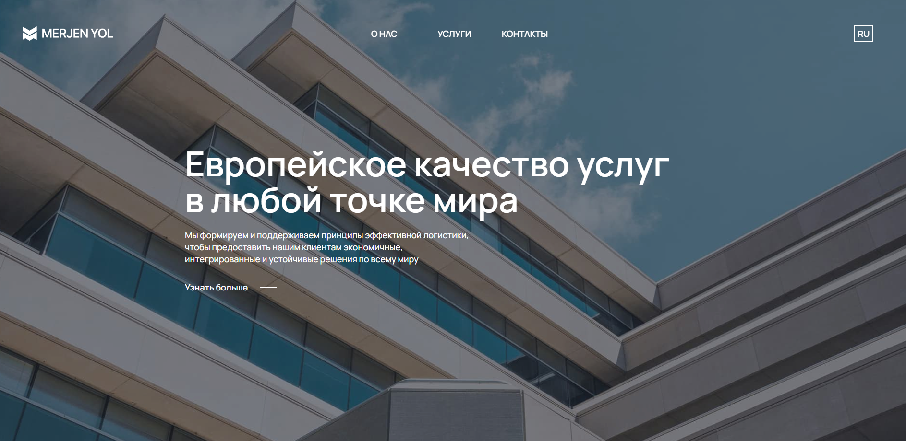
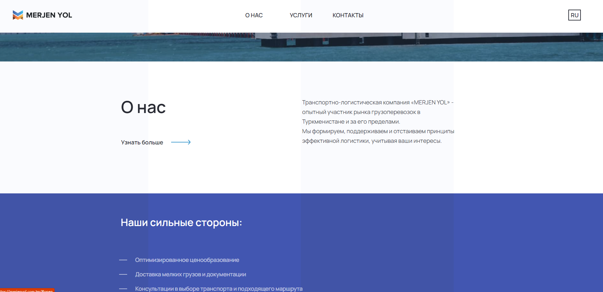
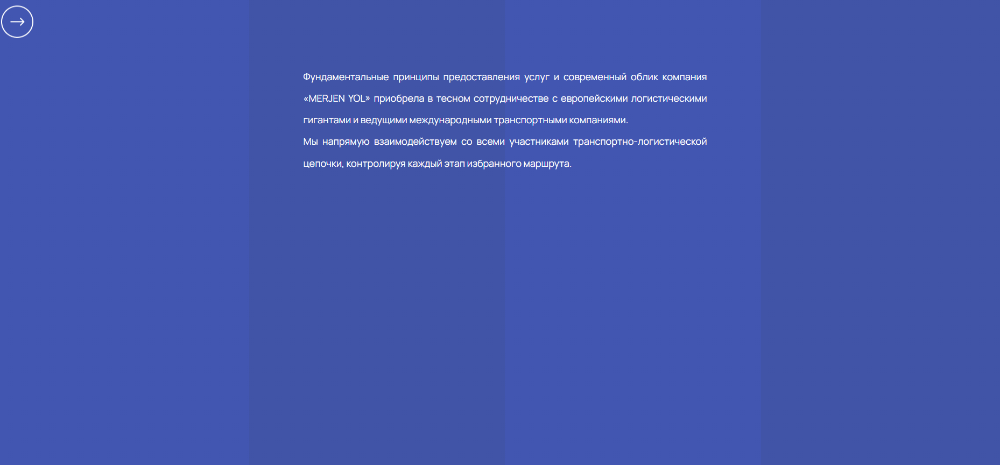
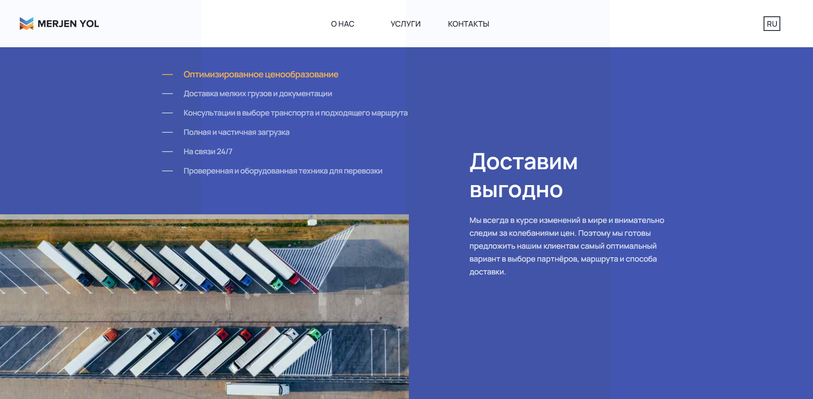
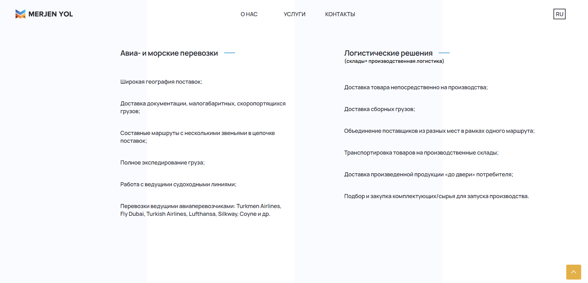
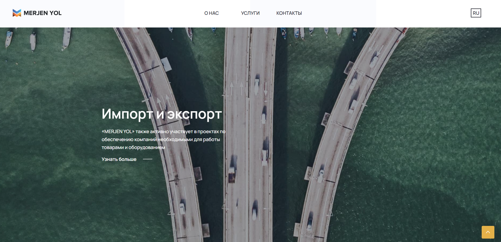
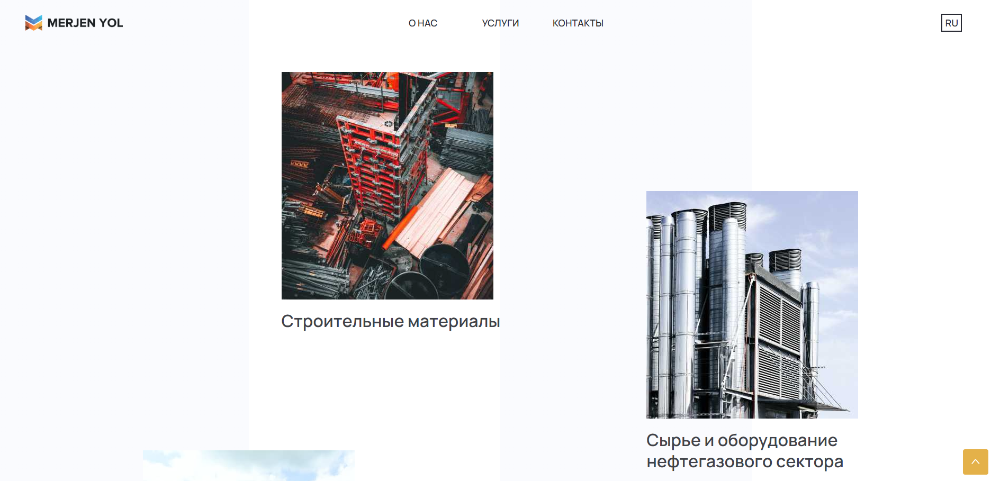
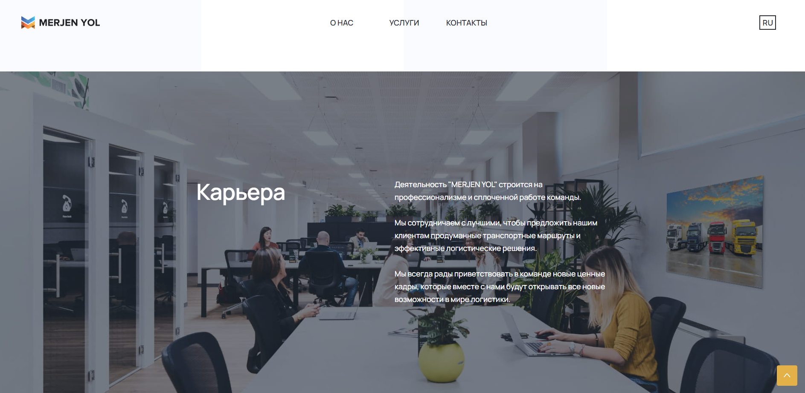
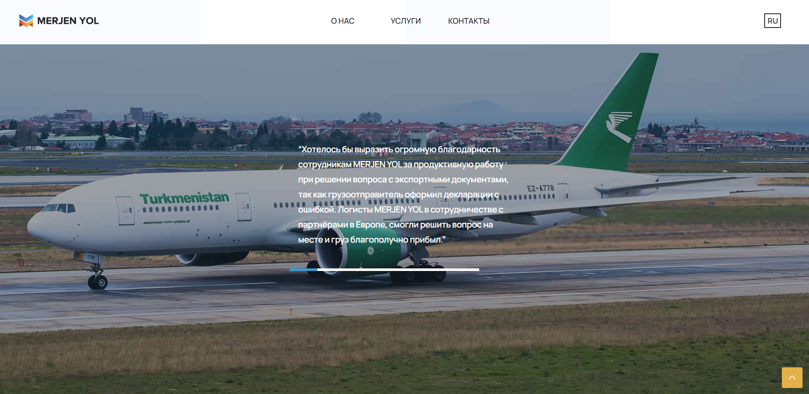
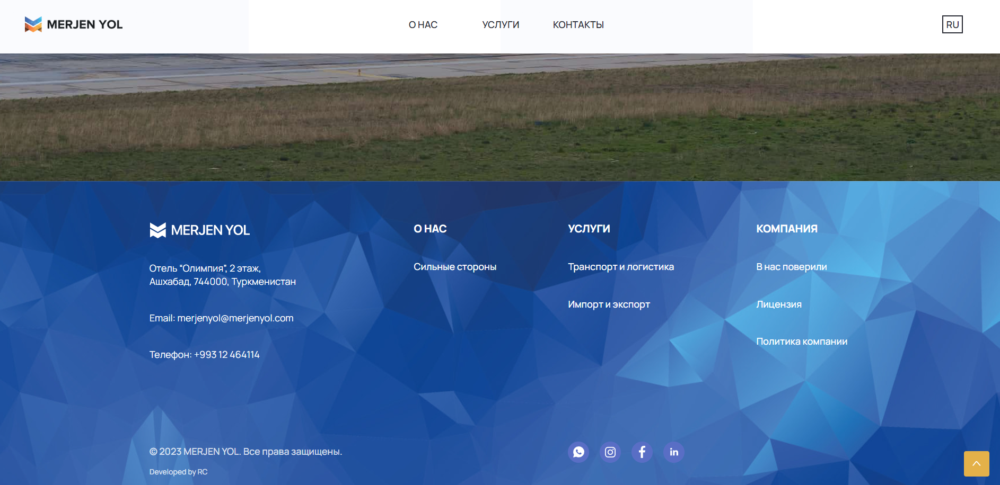

<h1 align="center" id="top">Merjen Yol</h1>

&#xa0;

<a href="https://merjenyol.com.tm/">PRODUCTION</a>

  

  

  

  <!--  -->

  <!--  -->

  <!--  -->

  

<!-- Status -->

<!-- <h4 align="center">
	🚧  Merjen_Yol 🚀 Under construction...  🚧
</h4>

 -->

  <a href="#dart-about">About</a> &#xa0; | &#xa0; 
  <a href="#rocket-technologies">Technologies</a> &#xa0; | &#xa0;
  <a href="#memo-screenshots">Screenshots</a> &#xa0; | &#xa0;
  <a href="#memo-contact">Author</a> 

 

## :dart: About

Landing page of the logistics company Merjen Yol based in Turkmenistan.

## :rocket: Technologies

The following tools were used in this project:

- [HTML](https://developer.mozilla.org/ru/docs/Web/HTML)
- [CSS](https://developer.mozilla.org/ru/docs/Web/CSS/Reference)
- [JavaScript](https://developer.mozilla.org/en-US/docs/Web/JavaScript)
- [JQuery](https://api.jquery.com/)
- [Wow.js](https://wowjs.uk/)

## :memo: Screenshots

 \
&#xa0;
 \
&#xa0;
 \
&#xa0;
 \
&#xa0;
 \
&#xa0;
 \
&#xa0;
 \
&#xa0;
 \
&#xa0;
 \
&#xa0;
 \
&#xa0;
 \
&#xa0;
 \
&#xa0;

## :memo: Contact

For any inquiries or questions, please contact <a href="https://github.com/RahymCharyyev" target="_blank">Rahym Charyyev</a>

&#xa0;

<a href="#top">Back to top</a>
